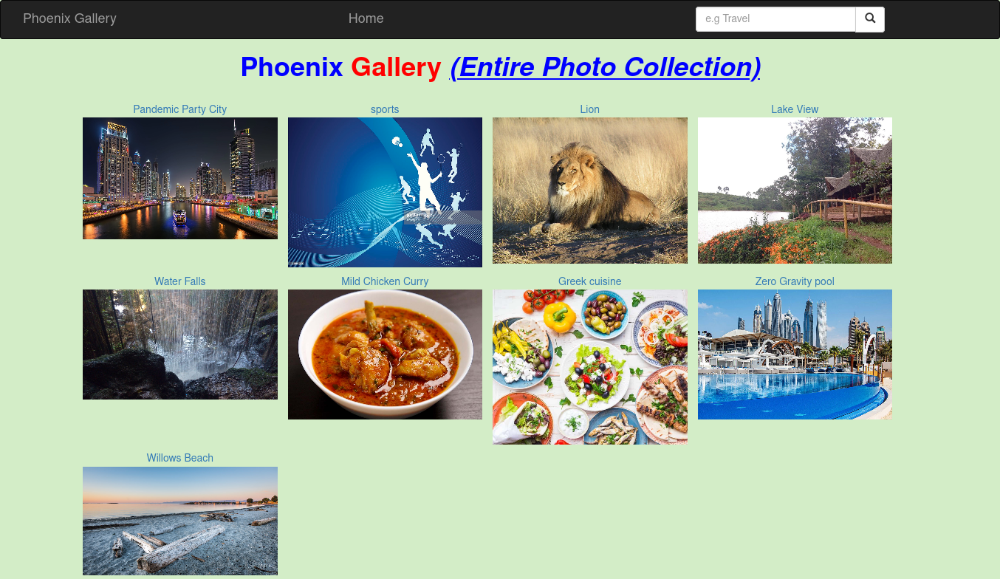
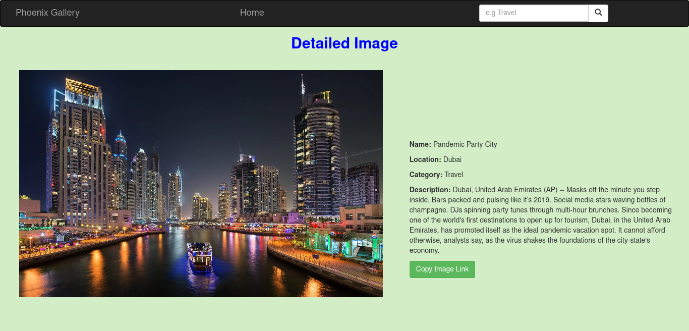
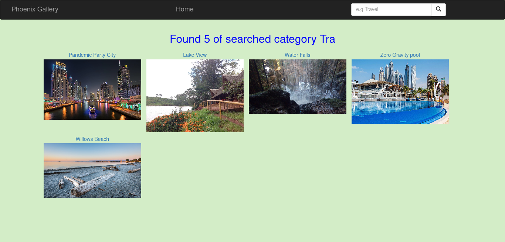

# Phoenix Gallery

# Author
Built by: Nyambura Njuguna

# Description
This Repository holds a gallery application where the user can view different photos, click on a photo to view its details, and search for a photo by categories

## User Story
The user can:
* View diffrent photos that interests them
* Click on a single photo to expand it and also view the details of the photo
* Search for different categories of photos. (ie. Travel, Food)
* Copy a link to the photo to share with my friends.

# Design
### Home page

### Detailed picture page

### Search results page

# Prerequisites
* python3.9
* pip
* Django

# Cloning
Open Terminal:

  $ git clone https://github.com/Kevson102/Personal-Gallery.git
  $ cd Personal-Gallery
  $ code . or atom . based on your text editor 
  
# Install all dependencies in requirements.txt

  $ pip install -r requirements.txt
  
# Running the Application
- on the code editor, change the configuration settings from prod to dev
* To run the application, open the cloned repo in terminal and run the following commands:

  $ python3.9 manage.py runserver

# Technologies Used
python 3.9
django
Django-Bootstrap3
Heroku - online deployment

Support and contact details
Incase of any issues at hand, please email me at kevson3941@gmail.com

# License
MIT License.
